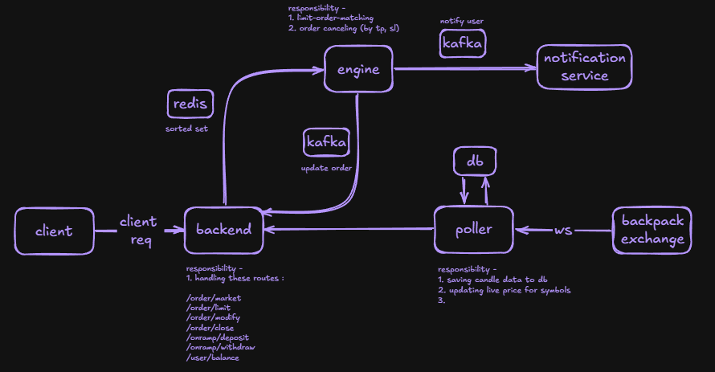

# CFD Trading App

A full-stack CFD/perpetuals trading application with a backend REST API, an
order-matching engine, a market-data poller, a shared contracts package, and a
Next.js frontend.



## Monorepo layout

```
.
├── packages/contracts   # shared NATS subjects, domain types, zod request schemas
├── backend              # Express REST API (auth, balance, orders, SSE)
├── engine               # order book + matcher + TP/SL & close execution
├── poller               # Backpack WS market data -> NATS prices + gRPC candles
└── frontend             # Next.js app (standalone, not in npm workspaces)
```

`backend`, `engine`, `poller` and `packages/contracts` are npm workspaces.
`frontend` is installed and run independently.

## Components

| Service   | Role                                                                                | Port   |
|-----------|-------------------------------------------------------------------------------------|--------|
| backend   | REST API, JWT auth, balance ledger, order lifecycle, SSE push events                | 5000   |
| engine    | In-memory order book, limit-order matching, TP/SL and close execution, rehydration  | 8081*  |
| poller    | Backpack WS subscription, live price NATS feed, candle persistence + gRPC server    | 8082*, 50051 |
| contracts | `@cfd/contracts` workspace package consumed by backend/engine/poller                | —      |
| frontend  | Next.js trading UI                                                                  | 3000   |

\* health-check ports. See each `.env.example` for exact configuration.

## Prerequisites

- Node.js 20+ and npm
- A running NATS server with JetStream enabled (e.g. `nats-server -js`)
- A running Redis instance
- A Postgres database (the project uses Prisma)

## Getting started

1. Install dependencies and build the shared contracts package:

   ```bash
   npm install
   ```

2. Configure environment files. Copy each `.env.example` to `.env` and fill in
   the values (see the [Environment](#environment) section):

   ```bash
   cd backend  && cp .env.example .env
   cd ../engine && cp .env.example .env
   cd ../poller && cp .env.example .env
   cd ../frontend && cp .env.example .env.local
   ```

3. Push the Prisma schema and start each service (each in its own terminal):

   ```bash
   cd backend && npm run dev        # REST API on :5000
   cd engine  && npm run dev        # order matching engine
   cd poller  && npm run dev        # market data poller
   cd frontend && npm run dev       # Next.js app on :3000
   ```

## Environment

| File                     | Key variables                                                        |
|--------------------------|----------------------------------------------------------------------|
| `backend/.env`           | `DATABASE_URL`, `JWT_SECRET`, `NODE_ENV`, `NATS_URL`, `REDIS_URL`, `CORS_ORIGIN`, `GRPC_URL` |
| `engine/.env`            | `DATABASE_URL`, `NATS_URL`                                           |
| `poller/.env`            | `BACKPACK_URL`, `DATABASE_URL`, `NATS_URL`, `REDIS_URL`              |
| `frontend/.env.local`    | `NEXT_PUBLIC_BACKPACK_URL`                                           |

## Useful commands

```bash
npm install          # install all workspace deps + builds @cfd/contracts
cd packages/contracts && npm run build   # rebuild shared package
cd backend  && npm run build             # typecheck backend
cd engine   && npm run build             # typecheck engine
```

## Documentation

- [ARCHITECTURE.md](./ARCHITECTURE.md) — components, data flows, NATS subjects,
  Redis keys, idempotency and error conventions.
